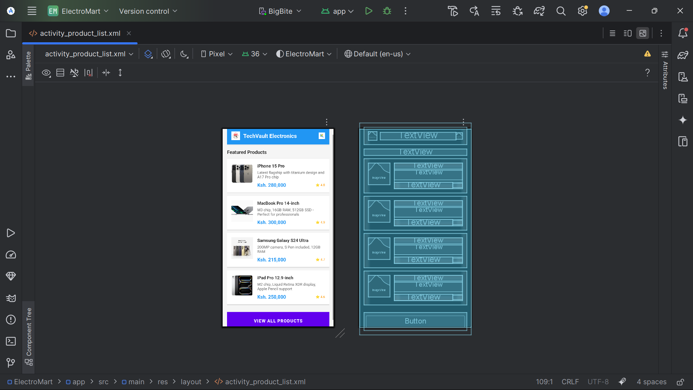
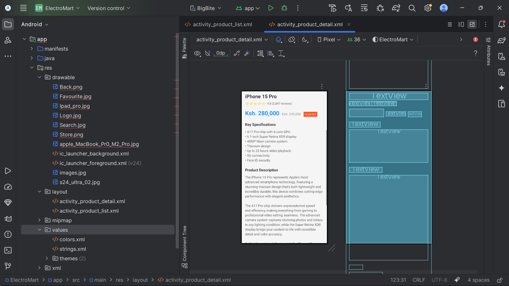
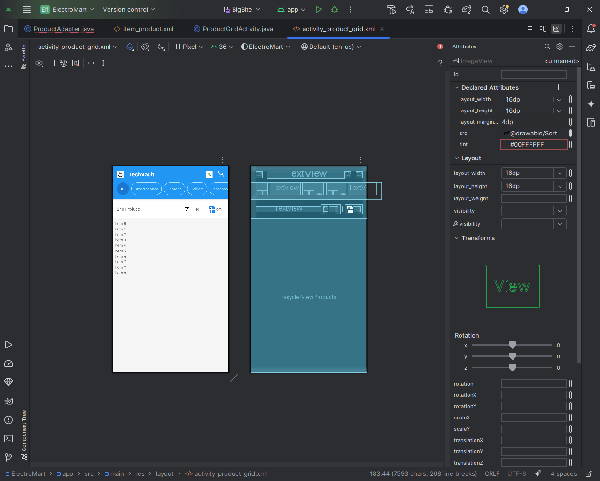

# ⚡ ElectroMart - Mobile Product Catalogue App

**ElectroMart** is a mobile app concept that serves as a sleek, user-friendly electronic products catalogue. Designed in Android Studio using **Java** and **XML**, the app allows users to browse electronics by categories, view detailed product information, and explore featured deals.

---

## 📱 Features

- 🛒 View electronic products in grid and list layouts
- 🔍 Browse by product category
- 📸 See detailed product pages (name, price, image, description)
- 🧪 Currently UI-focused with mock data (ready for backend integration)

---

## 🛠️ Tech Stack

| Area          | Tech                          |
|---------------|-------------------------------|
| Language      | Java                          |
| IDE           | Android Studio                |
| UI Layouts    | XML (LinearLayout, ConstraintLayout, RecyclerView) |
| Assets        | XML drawables, mock images    |
| Version Ctrl  | Git + GitHub                  |

---

## 📸 Screenshots

## 📸 Screenshots

### 🏠 Product List (LinearLayout)

### 🧾 Product Detail (ConstraintLayout)

### 🛍️ Grid Layout (RecyclerView)

### 📲 View All Products Button

